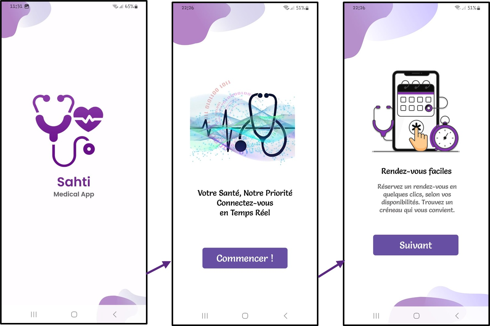
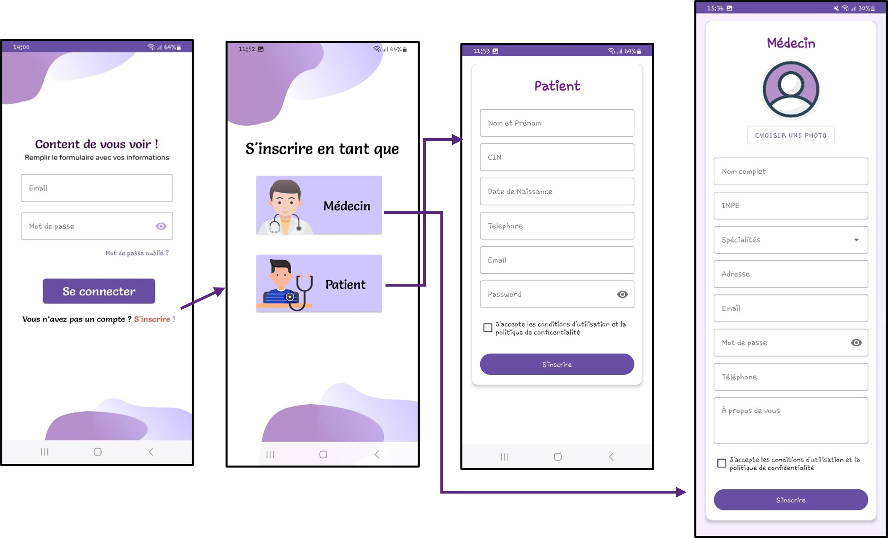
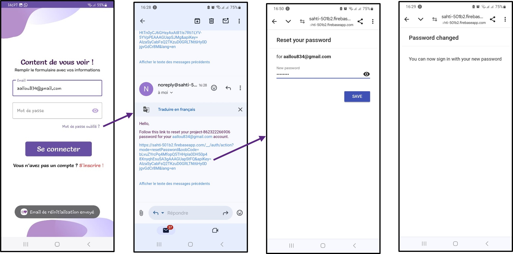
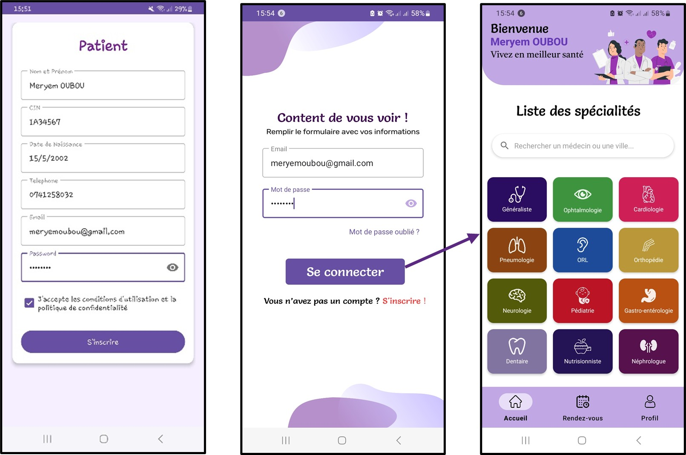
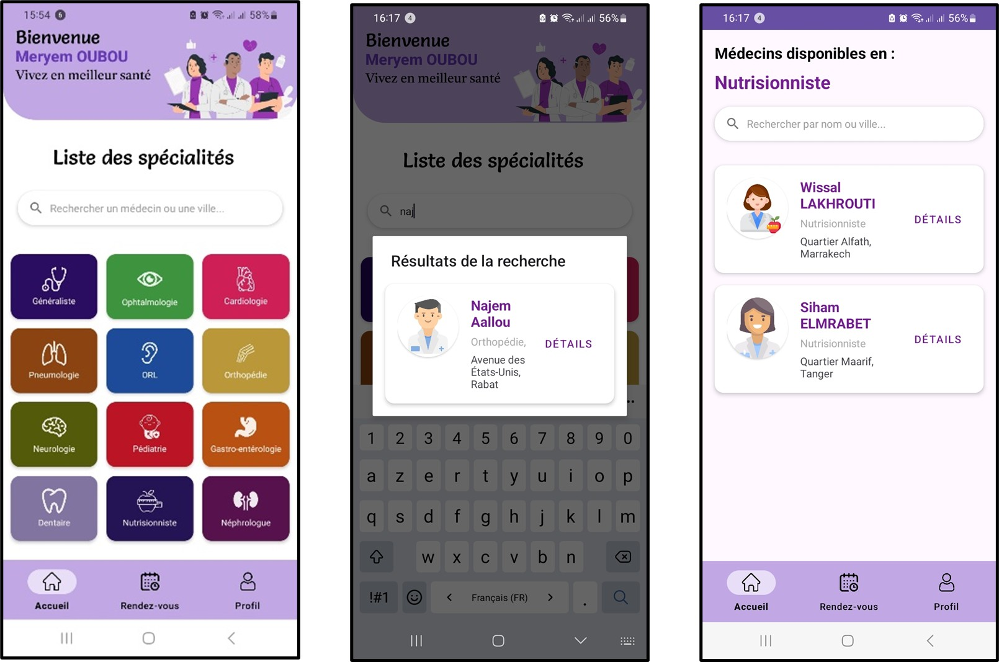
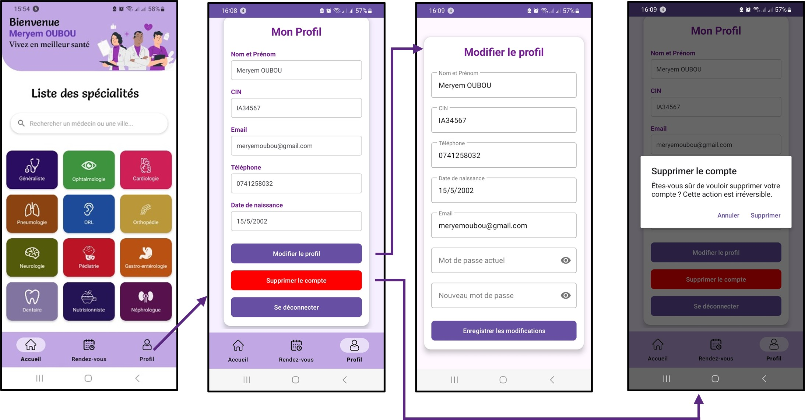
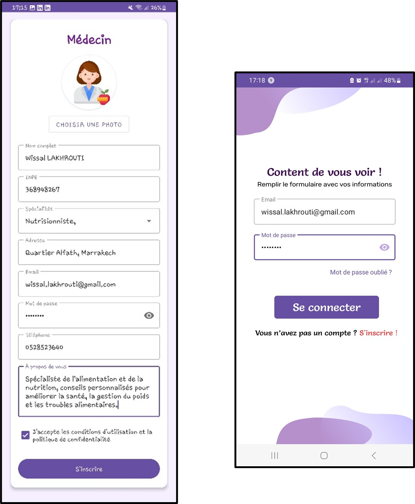
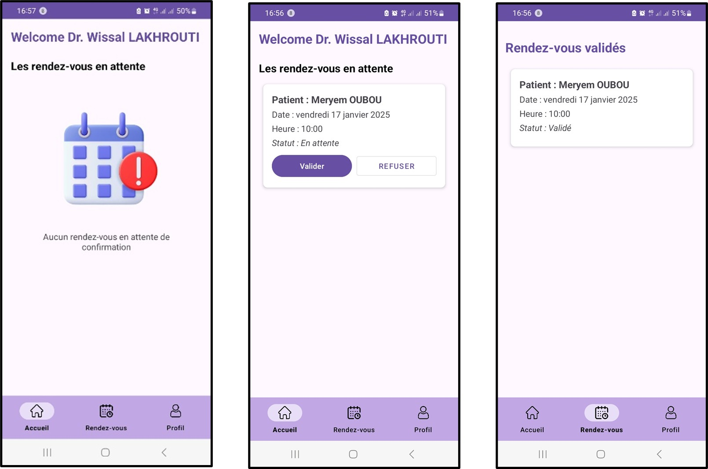
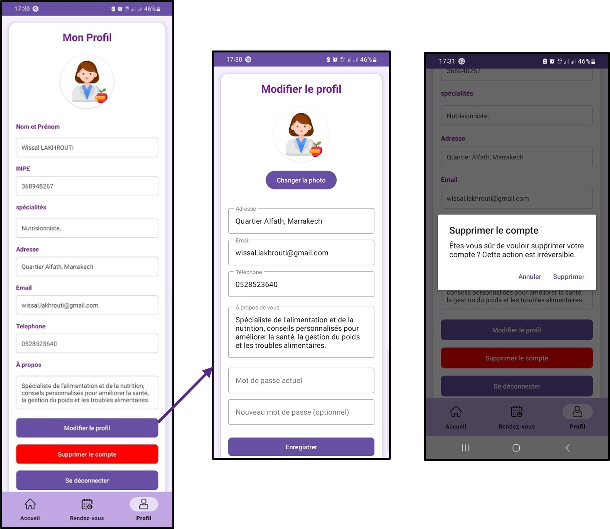

# 🏥 Sahti  
### 📅 Application mobile de gestion des rendez-vous médicaux

  

  <b>Faciliter la prise de rendez-vous médicaux entre patients et médecins</b> 
  Simple • Rapide • Sécurisée

---

## 🚀 À propos du projet

**Sahti** est une application mobile Android développée pour digitaliser et simplifier  
la gestion des rendez-vous médicaux.

Elle permet :

👤 Aux **patients** de rechercher un médecin et réserver un créneau  
🩺 Aux **médecins** de gérer efficacement leurs consultations  

🎯 Objectif : améliorer l’accès aux soins tout en garantissant la sécurité des données.

---

## ✨ Fonctionnalités

### 👤 Espace Patient
- 🔐 Création de compte & authentification sécurisée
- 🔎 Recherche de médecins (nom, spécialité, adresse)
- 📅 Prise de rendez-vous
- 📊 Suivi du statut (en attente, validé, refusé)
- 👤 Gestion du profil
- 🔑 Réinitialisation du mot de passe

---

### 🩺 Espace Médecin
- 🔐 Inscription & connexion sécurisée
- 📥 Consultation des demandes
- ✅ Acceptation / ❌ Refus des rendez-vous
- 📆 Visualisation par date
- 🧾 Gestion du profil professionnel

---

## 📸 Captures d’écran

### 🟢 Accueil

  

---

### 🔐 Connexion & Inscription

  

---

### 🔑 Mot de passe oublié

  

---

### 👤 Interface Patient

  
  
  

---

### 🩺 Interface Médecin

  
  
  

---

## 🎥 Démonstration vidéo

🎬 <b>Présentation complète sur YouTube</b>  
👉 https://youtu.be/XxCPERwC-eM?si=l-PECjS6PnCFE9D7

---

## 🛠️ Stack Technique

| Technologie | Description |
|-------------|--------------|
| **Kotlin** | Développement Android |
| **Android Studio** | IDE principal |
| **Firebase Authentication** | Gestion sécurisée des comptes |
| **Firebase Firestore / Realtime DB** | Base de données |
| **Figma** | UI/UX Design |
| **Cacoo** | Modélisation UML |
| **Git & GitHub** | Versioning |

---

## 🔐 Sécurité

- Authentification via Firebase
- Protection des données utilisateurs
- Validation des opérations sensibles
- Réinitialisation sécurisée par email

---

## 🎓 Contexte Académique

Projet réalisé dans le cadre du module :

📘 **Programmation Mobile**  
🎓 Master : *Systèmes de Télécommunications et Réseaux Informatiques*  
🏫 Université Sultan Moulay Slimane – FPBM  
📆 2024/2025  

### 👨‍💻 Équipe
- Wissal LakhrouTi  
- Meryem Oubou  
- **Najem Aallou**

---

## 🚀 Améliorations futures

- 🔔 Notifications & rappels automatiques
- 🏥 Historique médical du patient
- 🍎 Version iOS
- 🌍 Déploiement production

---

## 📄 Licence
Projet académique – Usage pédagogique uniquement.
