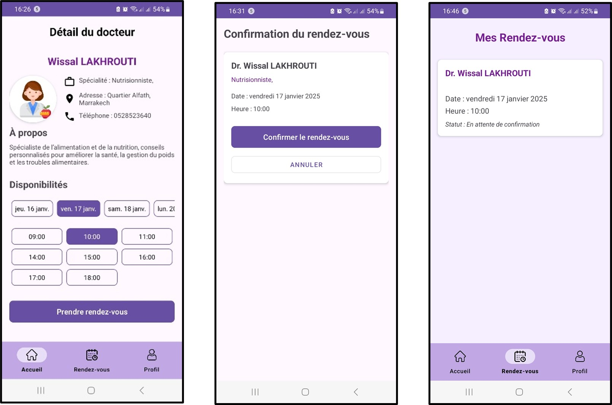

# 🏥 Sahti – Application de gestion des rendez-vous médicaux

Sahti est une application mobile Android conçue pour faciliter la **prise, la gestion et le suivi des rendez-vous médicaux** entre patients et médecins.  
Elle vise à améliorer l’accès aux soins, optimiser le temps des utilisateurs et garantir la sécurité des données médicales.

---

## 📱 Présentation de l’application

L’application permet :
- aux **patients** de rechercher un médecin, consulter ses informations et prendre des rendez-vous en ligne,
- aux **médecins** de gérer leurs rendez-vous, accepter ou refuser des demandes et organiser leurs consultations.

Sahti a été développée dans un cadre académique en utilisant des **technologies modernes** avec une attention particulière portée à :
- l’ergonomie,
- la simplicité d’utilisation,
- la sécurité des données.

---

## ✨ Fonctionnalités principales

### 👤 Patient
- Création de compte et authentification sécurisée
- Recherche de médecins par nom, spécialité ou adresse
- Prise de rendez-vous (date et heure)
- Suivi de l’état des rendez-vous (validé, en attente, refusé)
- Gestion du profil personnel
- Réinitialisation du mot de passe

### 🩺 Médecin
- Inscription et authentification
- Consultation des demandes de rendez-vous
- Acceptation ou refus des rendez-vous
- Visualisation des rendez-vous validés par date
- Gestion du profil professionnel

---

---

## 📸 Captures d’écran

### 🟢 Écrans d’accueil

  

---

### 🔐 Connexion & Création de compte

---

### 🔑 Mot de passe oublié

---

### 👤 Inscription & Authentification Patient

---

### 🔎 Consultation des médecins

---

### 📅 Prise de rendez-vous (Patient)

---

### 🧾 Profil Patient

---

### 🩺 Inscription & Authentification Médecin

---

### 📋 Gestion des rendez-vous (Médecin)

---

### 👨‍⚕️ Profil Médecin

---

## 🎥 Démonstration vidéo

📺 Présentation complète de l’application sur YouTube :  
👉 **Lien YouTube** : https://youtu.be/XxCPERwC-eM?si=l-PECjS6PnCFE9D7

---

## 🛠️ Technologies utilisées

- **Langage** : Kotlin  
- **IDE** : Android Studio  
- **Base de données & Backend** : Firebase  
  - Authentication  
  - Realtime Database / Firestore  
- **Design UI/UX** : Figma  
- **Modélisation UML** : Cacoo  
- **Gestion de version** : Git & GitHub  

---

## 🔐 Sécurité

- Authentification sécurisée via Firebase
- Protection des données utilisateurs
- Validation par mot de passe pour les opérations sensibles
- Réinitialisation sécurisée du mot de passe par e-mail

---

## 🎓 Contexte académique

Ce projet a été réalisé dans le cadre du **module Programmation Mobile**  
🎓 **Master : Systèmes de Télécommunications et Réseaux Informatiques**  
🏫 Université Sultan Moulay Slimane – Faculté Polydisciplinaire de Beni Mellal  
📆 Année universitaire : 2024/2025  

### 👨‍💻 Réalisé par :
- Wissal LakhrouTi  
- Meryem Oubou  
- **Najem Aallou**

---

## 🚀 Perspectives d’amélioration

- Notifications et rappels automatiques
- Historique médical du patient
- Déploiement sur d’autres plateformes (iOS)

---

## 📄 Licence
Projet académique – usage pédagogique.
